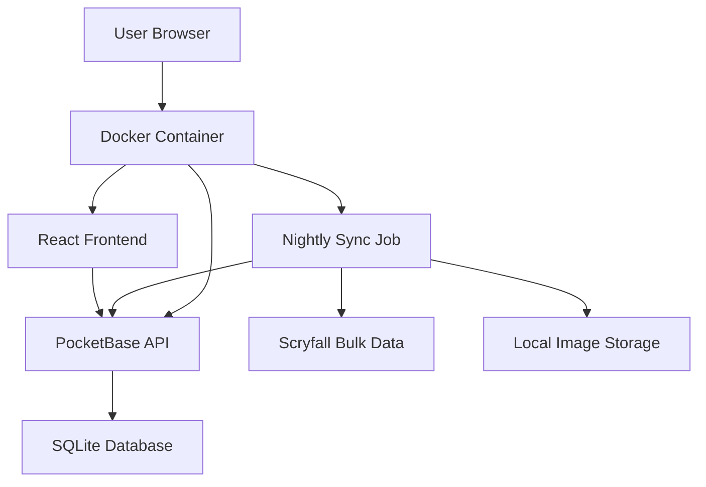

# Design Document

## Overview

The Spell Binder is a full-stack web application that enables users to catalog and manage their Magic: The Gathering card collections. The application follows a modern architecture with React providing a responsive frontend interface and PocketBase serving as the backend database and API layer. The system will integrate with external MTG card databases for card information and images while maintaining user collection data locally.

## Architecture

### System Architecture



### Technology Stack

- **Frontend**: React 18+ with TypeScript
- **Backend**: PocketBase (Go-based backend-as-a-service)
- **Database**: SQLite (embedded with PocketBase)
- **Data Sync**: Nightly bulk data sync from Scryfall
- **Image Storage**: Local image caching in PocketBase
- **Deployment**: Docker container for easy self-hosting
- **Styling**: Tailwind CSS for responsive design

## Components and Interfaces

### Frontend Components

#### Core Components
- **App**: Main application wrapper with routing
- **Dashboard**: Collection statistics and overview
- **CollectionView**: Grid/list view of user's cards
- **CardSearch**: Search interface for adding new cards
- **CardDetail**: Detailed view of individual cards
- **CollectionStats**: Statistics and analytics display

#### Shared Components
- **CardImage**: Reusable card image component with fallbacks
- **FilterBar**: Multi-criteria filtering interface
- **SearchInput**: Debounced search input component
- **LoadingSpinner**: Loading state indicator
- **Modal**: Reusable modal wrapper

### Backend Schema (PocketBase Collections)

#### Collections Collection
```javascript
{
  id: "string", // Auto-generated
  user_id: "string", // Future-proofing for multi-user
  card_id: "string", // Scryfall card ID
  quantity: "number",
  condition: "string", // NM, LP, MP, HP, DMG
  foil: "boolean",
  acquired_date: "datetime",
  notes: "text",
  created: "datetime",
  updated: "datetime"
}
```

#### Cards Collection (local card database)
```javascript
{
  id: "string", // Scryfall card ID
  name: "string",
  set_code: "string",
  set_name: "string",
  rarity: "string",
  mana_cost: "string",
  type_line: "string",
  colors: "json", // Array of colors
  image_file: "file", // Local image file stored in PocketBase
  price_usd: "number",
  last_updated: "datetime"
}
```

#### Sync_Status Collection (track bulk data updates)
```javascript
{
  id: "string",
  data_type: "string", // "cards", "sets", "prices"
  last_sync: "datetime",
  status: "string", // "success", "failed", "in_progress"
  records_processed: "number",
  error_message: "text"
}
```

### Data Synchronization

#### Bulk Data Sync Process
- **Nightly Sync Job**: Automated process to download Scryfall bulk data
- **Card Data**: Download complete card database from Scryfall bulk data endpoint
- **Image Sync**: Download and store card images locally on first access
- **Price Updates**: Periodic price data updates from bulk pricing data
- **Incremental Updates**: Track changes and only update modified records

#### Scryfall Bulk Data Endpoints
- **All Cards**: `https://api.scryfall.com/bulk-data/all-cards` - Complete card database
- **Default Cards**: `https://api.scryfall.com/bulk-data/default-cards` - One printing per card
- **Pricing Data**: Integrated within card data for current market prices

## Data Models

### Frontend Data Models

#### Card Interface
```typescript
interface Card {
  id: string;
  name: string;
  set_code: string;
  set_name: string;
  rarity: string;
  mana_cost: string;
  type_line: string;
  colors: string[];
  image_url: string;
  price_usd?: number;
}
```

#### CollectionEntry Interface
```typescript
interface CollectionEntry {
  id: string;
  card: Card;
  quantity: number;
  condition: CardCondition;
  foil: boolean;
  acquired_date: Date;
  notes?: string;
}
```

#### CardCondition Enum
```typescript
enum CardCondition {
  NEAR_MINT = 'NM',
  LIGHTLY_PLAYED = 'LP',
  MODERATELY_PLAYED = 'MP',
  HEAVILY_PLAYED = 'HP',
  DAMAGED = 'DMG'
}
```

### Data Flow

1. **Adding Cards**: User searches → Local card database → Display results → User selects → Save to Collections
2. **Viewing Collection**: PocketBase query → Join with local card data → Display in React
3. **Statistics**: Aggregate queries on collection data → Real-time updates via PocketBase subscriptions
4. **Data Sync**: Nightly job → Download bulk data → Update local Cards collection → Download missing images

## Error Handling

### Frontend Error Handling
- **Network Errors**: Retry mechanism with exponential backoff for PocketBase API calls
- **Image Loading**: Fallback to placeholder images for failed loads
- **Form Validation**: Client-side validation with user-friendly error messages
- **Search Performance**: Handle large local datasets efficiently

### Backend Error Handling
- **Database Constraints**: Proper validation rules in PocketBase schema
- **Sync Job Failures**: Retry logic and error logging for bulk data sync
- **Data Integrity**: Transaction handling for collection updates
- **Storage Errors**: Handle disk space and file system issues for image storage

### Error User Experience
- **Toast Notifications**: Non-intrusive error and success messages
- **Loading States**: Clear indication of ongoing operations
- **Offline Support**: Basic functionality when external APIs are unavailable

## Testing Strategy

### Frontend Testing
- **Unit Tests**: Jest and React Testing Library for components
- **Integration Tests**: Testing component interactions and API calls
- **E2E Tests**: Cypress for critical user flows (add card, view collection)

### Backend Testing
- **API Tests**: Test PocketBase collection operations
- **Data Validation**: Test schema constraints and validation rules
- **Sync Job Testing**: Mock bulk data downloads for sync job testing

### Test Coverage Goals
- **Components**: 80%+ coverage for core components
- **API Integration**: 100% coverage for external API wrapper functions
- **Critical Paths**: Full E2E coverage for add/edit/delete card flows

## Performance Considerations

### Frontend Optimization
- **Virtual Scrolling**: For large collections (1000+ cards)
- **Image Lazy Loading**: Load card images as they come into viewport
- **Debounced Search**: Prevent excessive API calls during typing
- **Memoization**: React.memo for expensive card rendering operations

### Backend Optimization
- **Card Caching**: Cache frequently accessed card data locally
- **Database Indexing**: Proper indexes on search and filter fields
- **Batch Operations**: Bulk insert/update for large collection imports

### Deployment Optimization
- **Docker Multi-stage**: Minimize container size
- **Static Asset Caching**: Proper cache headers for images and assets
- **Compression**: Gzip compression for API responses

## Security Considerations

### Data Protection
- **Input Validation**: Sanitize all user inputs
- **SQL Injection**: PocketBase handles this automatically
- **XSS Prevention**: Proper escaping of user-generated content

### Self-Hosting Security
- **Environment Variables**: Secure configuration management
- **HTTPS**: SSL/TLS configuration guidance
- **Access Control**: Optional authentication for multi-user scenarios

## Deployment Architecture

### Docker Configuration
- **Multi-stage Build**: Separate build and runtime stages
- **Volume Mounts**: Persistent storage for PocketBase database
- **Port Configuration**: Configurable ports for different environments
- **Health Checks**: Container health monitoring

### Environment Configuration
- **Development**: Hot reload for React, PocketBase admin UI enabled
- **Production**: Optimized builds, security headers, admin UI disabled
- **Configuration**: Environment-based settings for API endpoints and features